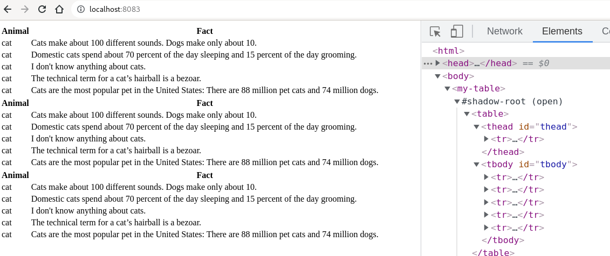

# Go/wasm Prototype for Webcomponents / customElements

This is just an expirement of how it could feel to write webcomponents with go.

Attributes and Properties are not implemented.

---

Example Component:



```go
package mytable

import (
	"go-webcomponents-prototype/exampleapi"
	"go-webcomponents-prototype/html"
)

func init() {
	html.Define("my-table", func() html.CustomElement { return &MyTable{} }, template)
}

const template = `
<table>
	<thead id="thead">
	</thead>
	<tbody id="tbody">
	</tbody>
</table>
`

type MyTable struct {
	THead html.Element `id:"thead"`
	TBody html.Element `id:"tbody"`
}

func (m *MyTable) ConnectedCallback(host html.Element) {

	header := html.CreateElement("tr")
	for _, name := range []string{"Animal", "Fact"} {
		th := th(name)
		header.Append(th)
	}
	m.THead.Append(header)

	go func() {
		facts := <-exampleapi.GetFacts()
		for _, fact := range facts {
			row := html.CreateElement("tr")
			for _, value := range []string{fact.Animal, fact.Text} {
				td := td(value)
				row.Append(td)
			}
			m.TBody.Append(row)
		}
	}()

}

func td(text string) html.Element {
	td := html.CreateElement("td")
	td.NodeValue().Set("textContent", text)
	return td
}

func th(text string) html.Element {
	th := html.CreateElement("th")
	th.NodeValue().Set("textContent", text)
	return th
}

```

